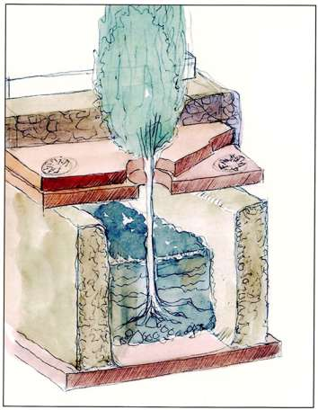

##### **Province:** _____
##### **Time Period:** _____

The building of a religious complex, identified by scholars as the Heligabalium (later dedicated to Jupiter Ultor) was the final transformation in antiquity of the NW terrace (Fig. 3). An enormous peripteral temple facing west was enclosed by three porticoes on the west (with a monumental entrance), north and south, and by a closed gallery at the east. Construction may have started as early as 190, but the buildings took shape only later in two successive periods, the first ending around 210/220, the second at least by the years 220 to 240.

Two garden areas at the south of the temple (for symmetry the same type of gardens may be surmised at the north) have been uncovered, one measuring 17 x 20.5 meters, the other of the same width, but with a length of at least 24 meters. The two areas were separated by a wide paved path running north-south that led to a secondary doorway at the south, giving access to the imperial palace complex (Fig. 4). Thus the larger garden (not fully excavated) may have extended uninterrupted for a length of some 42 meters.

Both gardens had the same tripartite configuration: running along their lengths (east-west axis) was a wide central flowerbed flanked by clay paths and narrower beds. In each of the beds were discovered halved amphorae used as flowerpots that were sunken into the ground (Figs. 5, 6). The narrower beds held large amphorae alternating with smaller ones. The wider, middle beds had large amphorae defining the median axis, and smaller amphorae, tightly aligned, along the border. The purpose of these pots was to maintain humidity at the roots (particularly important for an artificial terrace), and perhaps to limit the growth of the plants.

All the pots (dating from the middle of the second century to the early 3rd century) appear to have been buried at the same time, suggesting they represent the original garden design for this early third century complex. No plant remains have been identified, however dwarf cypress or plane trees could have been planted in the larger pots and the small amphorae along the border of the middle beds may have been for box hedges (Fig. 4).

Similar planting cavities were also regularly spaced along the N-S path leading to the doorway through the south portico. These cavities, carved after the floor was laid, were connected to an underground canals that contained three transverse branches with openings used for irrigation. Excess water was drained via a connection to a sewer along the south portico (Fig. 6). To facilitate drainage the canals were filled with fine soil, alternating with layers of marble shards and stones. Between this permeable soil and the marble paving slabs were bipedales covered by a layer of mortar. The plantings, surrounded by marble, must  conveyed the impression of growing directly out of the pavement (Fig. 19 Warning: this doesn't refer to any figure in the page).

Within this planted environment were fountains and other decorative, or more likely, religious features, such as statues, altars and perhaps even standards which, according to eastern custom, would have depicted divinities associated with the god to whom the sanctuary was dedicated.

Although the specific plantings cannot be identified, it is safe to speculate that no plants had excessive foliage. We should imagine a strictly manicured and rectilinear garden that reflected, without dominating, the nearby architecture of temple and porticoes.

###### *Françoise Villedieu*  

#### Image Captions
* Fig. 1. View of the southern wall, which separated the Heliogabalium from the Domus Augustana.
* Fig. 2. Reconstruction of the late monumental complex.
* Fig. 3.  Reconstruction of the temple garden. Watercolor by J.-M. Gassend, based on the computer generated reconstruction by P. Veltri, in collaboration with F. Villedieu.
* Fig. 4. Halved amphorae used as flowerpots in the Severan gardens. Photography by C. Durand.
* Fig. 5. Reconstruction of part of the temple garden. Watercolor by J.-M. Gassend, based on the computer-generated reconstruction by P. Veltri and N. André, in collaboration with F. Villedieu.
* Fig. 6.  Reconstruction of a tree and planting bed in the temple garden. Watercolor by J.-M. Gassend, based on the computergenerated reconstruction by P. Veltri and N. André, in collaboration with F. Villedieu.

#### Bibliography
* F. Chausson, “Le site de la Vigna Barberini de 191 à 455” in *La Vigna Barberini I. Histoire d’un site. Étude des sources et de la topographie*, Rome, 1997, pp. 31-85; M. Royo, “Constructions antérieures au grand temple «sévérien»” in *La Vigna Barberini I, op. cit.*, pp. 21-26 (Adonea).
*  H. Broise and Y. Thébert, “Élagabal et le complexe religieux de la Vigna Barberini,“ *Mélanges de l’École Française de Rome*, 111 (1999), pp. 729-747; Y. Thébert, “Il santuario di Elagabalus: un giardino sacro” in F. Villedieu, ed., *Il giardino dei cesari*, Exhibition catalogue (Rome, Museo Nazionale Romano, Terme di Diocleziano, Oct. 2001- Jan. 2002), Rome, 2001, pp. 83-94.
*  G. Rizzo, “Le anfore utilizzate come vasi da fiori nei giardini del tempio” in F. Villedieu, ed., *Il giardino dei cesari*, Exhibition catalogue (Rome, Museo Nazionale Romano, Terme di Diocleziano, Oct. 2001- Jan. 2002), Rome, 2001, p. 98.
