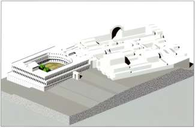
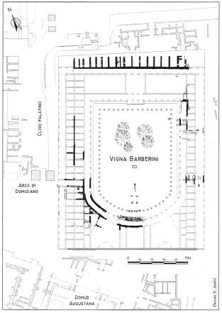
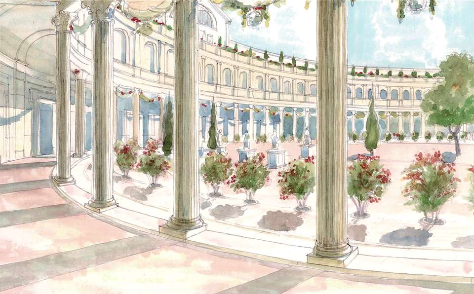
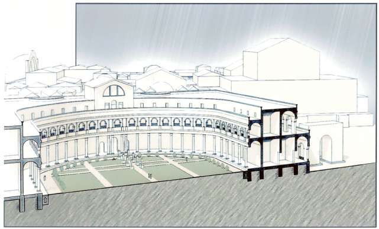
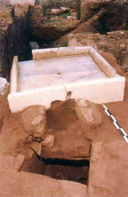
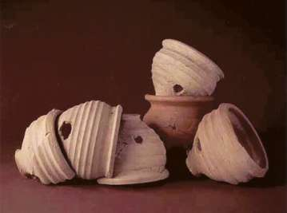
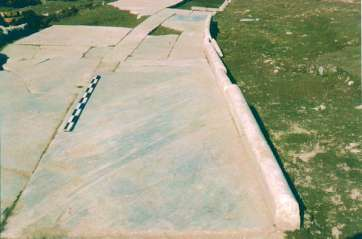
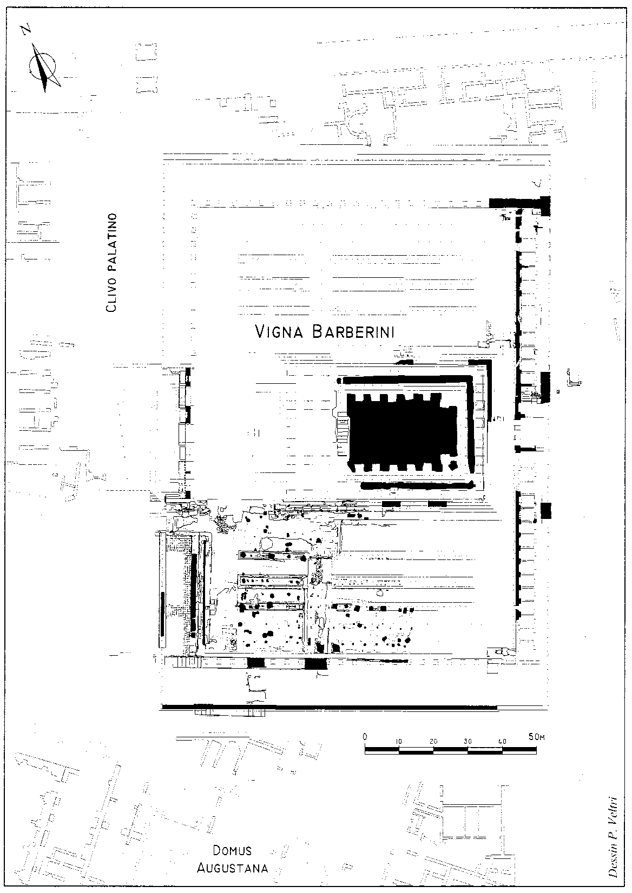

##### **Province:** _____
##### **Time Period:** _____

During the period of Domitian (81-96 A.D.) a large artificial platform with massive substructures at the north, east and west was completed at the site of the Vigna Barberini. On this platform stood a large structure with a curvilinear plan at the south, and with colonnaded aisles on the east and west (the north is not excavated) that enclosed a vast garden (Fig. 1). Over one-third of this garden area has been partly explored, another third was irrevocably destroyed when the later temple of *Elagabalus* was built, and the final third, at the north, remains to be excavated.

Only a few elements of the ancient garden were found in place. In particular, a large rectangular basin (measuring 8.70 meters by 5.30 meters), ornamented with alternating rectangular and semicircular niches faced in marble, was on axis with the center of the curved façade. Shortly after construction settling of the soil used to create the artificial terrace caused a rapid degradation of the whole northern section of the garden. During Hadrian’s reign refurbishment and re-construction was undertaken, the results of which lasted up to the end of the second century A.D. This second phase is better recorded than the first, but it is possible that care was taken to preserve at least some trees of the Flavian period.

The Hadrianic garden was enclosed by a portico, presumably an *ambulation* - a common feature of Roman gardens (Figs. 6, 7). Running parallel to the east and west colonnades were wide strips of beaten clay bordered on the inside by medium-sized trees, possibly laurels. In the middle of the garden were likely three (two have been identified) parallel clay paths running north/south. At the southern terminus of the central path is a small masonry formation, possibly the base of an altar, flanked by two concrete bases covered with white marble.

At least at the south (the only excavated area) two other paths run east-west, forming a regular gridded pattern. It is possible that the entire garden had an orthogonal layout of paths that were resurfaced numerous times throughout the second century. At the corners of the crossings were discovered square and rectangular bases of masonry that likely supported sculptures. In addition, several flowerpots came to light at the corners of these bases as well as inside the rectangular beds formed by the paths.

On either side of the southernmost statue bases (those nearest the curvilinear portico) were two fountains, the only remains *in situ* of which is a marble slab framed by plinths, forming a shallow basin with a hole in its center to receive a lead pipe (Fig. 5). A circular imprint (0.69 meters in diameter) on the surface of this slab suggests that water would have cascaded from an upper basin onto the shallow rectangular basin, out through a hole in the side of the plinth and into a marble canal connected to the main water collecting system underground. This canal ran just outside the curved portico in a position to collect rainwater from the roof, but because of the considerable width (1.8 meters) it also functioned as a decorative device. The few numbers of manholes for drainage could have been easily closed to allow water to remain in this canal not only to cool the air, but also to reflect the columns of the portico and the nearby plants.

Because of the imprint of lead pipes identified during excavation and the network of underground drainage a large fountain further north, not uncovered, was likely on the north-south median axis of the garden. Furthermore, scant remains of a building, destroyed by the later Severan temple as well as by earlier archaeological excavations, have come to light on the same north-south central axis. The thin walls suggest a simple garden kiosk that, however, would have been adorned by at least two marble columns (no longer extant), the bases for which were richly carved with leaves and shells.

Throughout the second century a series of repairs attempted to slow the subsiding soil on the platform, but to no avail. Perhaps also as a result of a fire, which raged through Rome in 191/192, the gardens and buildings on the site of the Vigna Barberini were destroyed and the construction of a new monumental complex was undertaken.

###### *Jean-Paul Morel*  

#### Image Captions
* Fig. 1. Reconstruction of the Flavian Palace.
* Fig. 2. Map and hypothetical reconstruction of the structures and garden excavated on the site of the Vigna Barberini.
* Fig. 3. Hypothetical reconstruction of the Flavian garden.
* Fig. 4. Hypothetical reconstruction of the southern portion of the Flavian garden.
* Fig. 5. Base of a fountain.
* Fig. 6. Flowerpots found in the gardens of the first and second century.
* Fig. 7. Detail of the marble canal.
* Fig. 8. Plan of the late monumental complex of the Vigna Barberini.

#### Bibliography
* M. Royo, *Domus Imperatoriae, Topographie, formation et imaginaire des palais impériaux du Palatin*, Rome, 1999.
* F. Villedieu and N. André, *Propositions pour une reconstitution de l'édifice flavien et de l'ensemble monumental tardif de la Vigna Barberini (Rome, Palatin)*, Actes du Colloque: Rome An 2000 (Caen, Sept. 2000), in press.
* J.-L Desnier, “Una borsa persa durante i lavori di terrazzamento” in F. Villedieu, ed., *Il giardino dei cesari*, Exhibition catalogue (Rome, Museo Nazionale Romano, Terme di Diocleziano, Oct. 2001- Jan. 2002), Rome, 2001, pp. 57-58.
* F. Villedieu, “Il corpo settentrionale e i giardini del palazzo imperiale flavio” in F. Villedieu, ed., *Il giardino dei cesari*, Exhibition catalogue (Rome, Museo Nazionale Romano, Terme di Diocleziano, Oct. 2001- Jan. 2002), Rome, 2001, pp. 59-71.
* J.-P Morel, “Il giardino adrianeo” in F. Villedieu, ed., *Il giardino dei cesari*, Exhibition catalogue (Rome, Museo Nazionale Romano, Terme di Diocleziano, Oct. 2001- Jan. 2002), Rome, 2001, pp. 73-75.
*  S. Leo, “Vasi da fiori” in F. Villedieu, ed., *Il giardino dei cesari*, Exhibition catalogue (Rome, Museo Nazionale Romano, Terme di Diocleziano, Oct. 2001- Jan. 2002), Rome, 2001, pp. 75-76.
