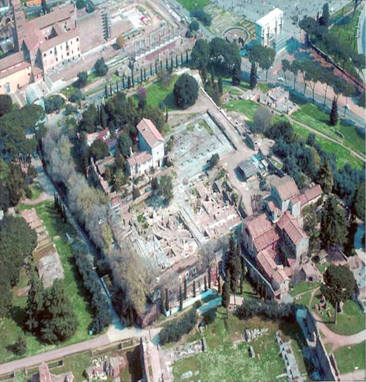
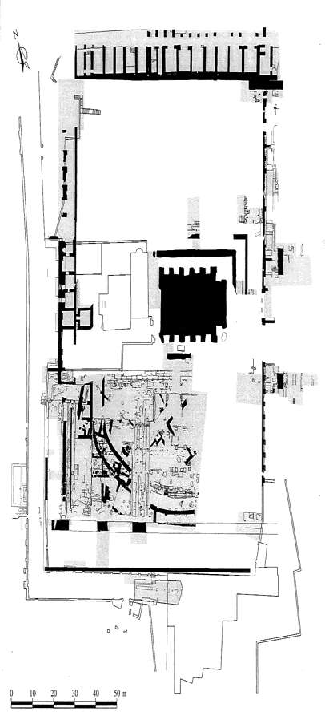

##### **Province:** _____
##### **Time Period:** _____

The artificial terrace that now carries the Barberini family name is located on the northeastern corner of the Palatine, beyond the visible remains of the Flavian Imperial palace (Fig. 1). Excavations carried out during the 1930s by A. Bartoli, and in the 1950s by G. F. Carettoni concentrated primarily on the central area of this site. These campaigns revealed the foundations of a large temple, which Bartoli identified, consistent with the earlier ideas of P. Bigot, as the remains of the late second-century temple of Elagabalus.

Recent investigations by the Soprintendenza Archeologica in collaboration with École française de Rome have revealed further episodes of the history of the area.

Approximately one third of the site has been explored, although the most ancient levels have been reached only sporadically (Fig. 2). The information gathered during the campaigns carried out annually between 1985 and 1999 are at present being analyzed, so that some of the information presented here must be considered provisional.

The excavations that reached levels prior to the rise of the Empire revealed a peristyle of a large domus once decorated with plants and basins. Probably destroyed during the 60s of the first century A.D., this luxurious dwelling was then buried under thick layers of soil used to create an artificial terrace that was a grand garden of the palace of Domitian. About a century later, during the last years of the second century, this section of the Imperial palace was demolished to make room for a monumental complex centered around a temple dedicated by the emperor Heliogabalus to the eastern god, Elagabalus, later rededicated by Alexander Severus to Jupiter Ultor.  

###### *Françoise Villedieu*  

#### Image Captions
* Fig. 1. Aerial photograph of the Vigna Barberini taken early 1999.
* Fig. 2. Vigna Barberini: plan of the areas explored from 1985 to 1998.

#### Bibliography
* P. Bigot, “Le temple de Jupiter Ultor et la Vigna Barberini,” BullCom 1911, pp. 80-
85.
*  F. Villedieu, J.-P Morel, P. Pergola, H. Broise, Y. Thébert, P. Gros, E. Hubert, et alii, “Rome: le Palatin (Vigna Barberini),” *Mélanges de l’École Française de Rome* 98 (1986) pp. 387-396; 99 (1987) pp. 481-498; 100 (1988) pp. 505-525; 101 (1989) pp. 489-498; 102 (1990) pp. 443-471; 103 (1991) pp. 313-338; 104 (1992) pp. 465-493; 105 (1993) pp. 419-439; 106 (1994) pp. 431-450; 107 (1995) pp. 459-493; 108 (1996) pp. 423-451; 109 (1997) pp. 417-440; 110 (1998) pp. 473-492; 111 (1999) pp. 449-481; 112 (2000) pp. 413-432.
*  M. Royo, F. Chausson, E. Hubert, *et alii, La Vigna Barberini I. Histoire d’un site. Étude des sources et de la topographie*, Rome, 1997.
* M.A. Tomei, “La ex Vigna Barberini e le aree limitrofe: documentazione dall’archivio della Soprintendenza archeologica” *La Vigna Barberini I, op. cit*, pp. 191-210.
*  C. Virlouvet, F. Villedieu, et alii, “Fouilles de l’École française de Rome sur le site
de la Vigna Barberini (Palatin),” *Bollettino di Archeologia* 23-24 (1993), pp. 131-164.
*  F. Villedieu, “La Vigna Barberini (Palatino): nuove acquisizioni,” *Archeologia Laziale* XII, *Quaderni di Archeologia Etrusco-italica* 1995, pp. 33-39.
*  F. Villedieu, “Constructions impériales mises au jour à l'angle N-E du Palatin. Résultats des fouilles de l'École française de Rome sur le site de la Vigna Barberini,” *Comptes Rendus de l’Académie des Inscriptions & Belles-Lettres*,1995, pp. 719-736.
*  J.-P. Morel, “Stratigraphie et histoire sur le Palatin : la zone centrale de la Vigna Barberini,” *Comptes Rendus de l’Académie des Inscriptions & Belles-Lettres*, 1996, pp. 173-205.
*  F. Villedieu, P. Veltri, “Les soutènements nord-ouest et nord de la terrasse de la Vigna Barberini (Rome, Palatin): constructions et remaniements de l’époque flavienne à l’époque sévérienne,” *Mélanges de l’École Française de Rome*, 111 (1999), pp. 749-778; F. Villedieu , *et alii, Il giardino dei cesari*. Exhibition catalogue (Rome, Museo Nazionale Romano, Terme di Diocleziano, Oct. 2001- Jan. 2002), Rome, 2001.
